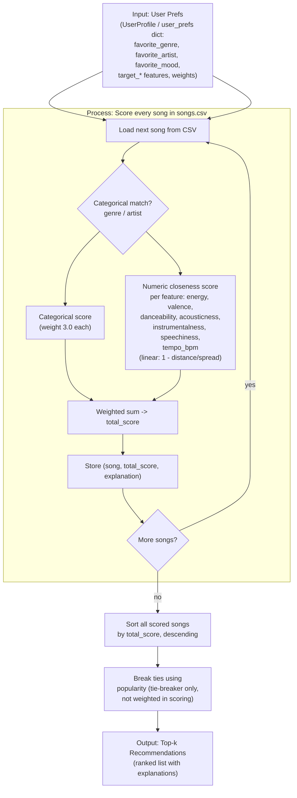

# Recommender Data Flow

```mermaid
flowchart TD
    A["Input: User Prefs<br/>(UserProfile / user_prefs dict:<br/>favorite_genre, favorite_artist, favorite_mood,<br/>target_* features, weights)"] --> B

    subgraph Loop["Process: Score every song in songs.csv"]
        direction TB
        B["Load next song from CSV"] --> C{"Categorical match?<br/>genre / artist"}
        C --> D["Categorical score<br/>(weight 3.0 each)"]
        C --> E["Numeric closeness score<br/>per feature: energy, valence,<br/>danceability, acousticness,<br/>instrumentalness, speechiness,<br/>tempo_bpm<br/>(linear: 1 - distance/spread)"]
        D --> F["Weighted sum -> total_score"]
        E --> F
        F --> G["Store (song, total_score, explanation)"]
        G --> H{"More songs?"}
        H -- yes --> B
    end

    A --> B
    H -- no --> I["Sort all scored songs<br/>by total_score, descending"]
    I --> J["Break ties using<br/>popularity (tie-breaker only,<br/>not weighted in scoring)"]
    J --> K["Output: Top-k Recommendations<br/>(ranked list with explanations)"]
```
